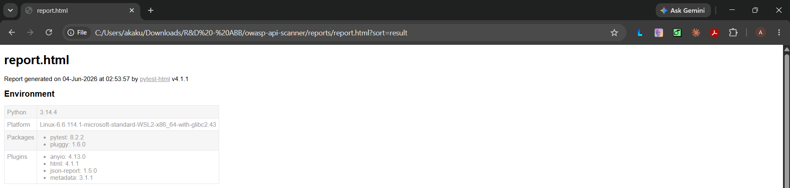
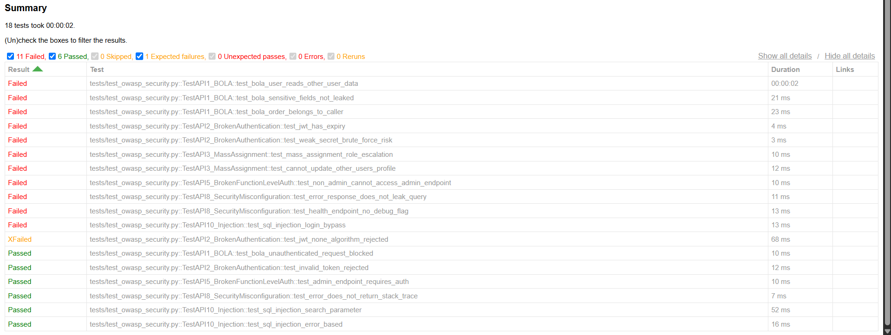
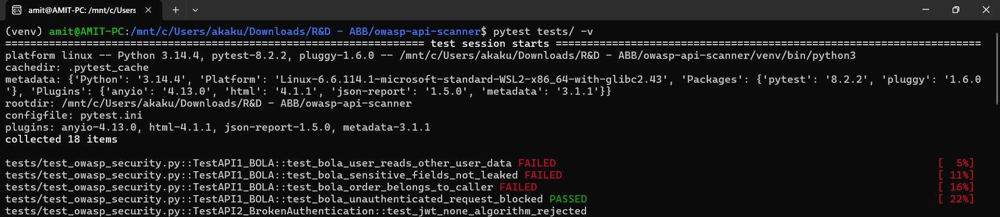
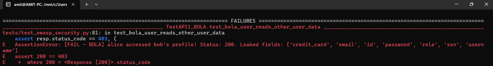
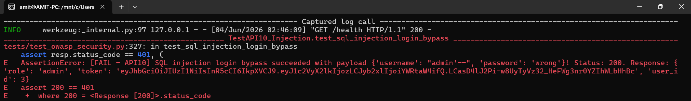
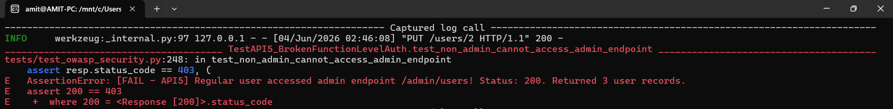
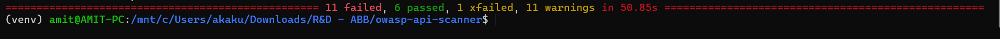

# owasp-api-watchdog

> Automated security testing framework targeting **OWASP API Security Top 10 (2023)**,
> integrated into a multi-stage GitHub Actions DevSecOps pipeline with SAST, dependency
> scanning, and container vulnerability scanning.

---

## What This Is

This project demonstrates a complete DevSecOps pipeline applied to API security testing.
It has two components:

1. **Vulnerable Flask API** (`app/vulnerable_api.py`) — an intentionally flawed REST API
   containing real OWASP Top 10 vulnerabilities, used as the security testing target.
2. **Automated Security Test Suite** (`tests/test_owasp_security.py`) — a pytest-based
   scanner that programmatically attacks the API and asserts on vulnerability presence,
   organized by OWASP category.

The GitHub Actions pipeline (`devsecops.yml`) runs four security stages on every push:
Semgrep SAST, Bandit static analysis, pip-audit dependency scanning, Trivy container
scanning, and the full pytest OWASP suite.

---

## OWASP Coverage

| OWASP ID | Category | Status | Tests |
|---|---|---|---|
| API1:2023 | Broken Object Level Authorization (BOLA) | ✅ Tested | 4 |
| API2:2023 | Broken Authentication | ✅ Tested | 4 |
| API3:2023 | Broken Object Property Level Authorization | ✅ Tested | 2 |
| API5:2023 | Broken Function Level Authorization | ✅ Tested | 2 |
| API8:2023 | Security Misconfiguration | ✅ Tested | 3 |
| API10:2023 | Unsafe Consumption / Injection (SQLi) | ✅ Tested | 3 |

**Expected results: 11 FAIL, 6 PASS, 1 XFAIL.**
The FAILs are correct — each one is a vulnerability the scanner confirmed in the target API.

---

## Test Results

### HTML Report — pytest-html summary





The report shows all 18 tests across 6 OWASP categories. Every red "Failed" row is a
confirmed vulnerability, not a broken test.

### Terminal Output

**Test session startup and first BOLA failures:**



**BOLA proof — alice reads bob's full profile including SSN and credit card:**



**SQL injection proof — `admin'--` payload returns a valid admin JWT:**



**Broken Function Level Auth — regular user reaches `/admin/users`:**



**Final summary — 11 failed, 6 passed, 1 xfailed:**



---

## Repository Structure

```
owasp-api-watchdog/
├── app/
│   └── vulnerable_api.py       # Flask API with deliberate OWASP flaws
├── tests/
│   ├── conftest.py              # pytest path setup
│   └── test_owasp_security.py  # OWASP test suite (18 tests, 6 categories)
├── scripts/
│   ├── parse_bandit.py          # Bandit JSON parser + pipeline gate
│   └── parse_pip_audit.py       # pip-audit JSON parser + pipeline gate
├── .github/
│   └── workflows/
│       └── devsecops.yml        # 5-stage GitHub Actions pipeline
├── screenshots/                 # Local run proof (committed)
├── Dockerfile                   # Container image for Trivy scan
├── semgrep.yml                  # Custom Semgrep rules (OWASP-mapped)
├── pytest.ini                   # pytest configuration
├── requirements.txt             # Python dependencies
└── run_local.py                 # One-command local pipeline runner
```

> `reports/`, `__pycache__/`, `.pytest_cache/`, and `venv/` are gitignored.

---

## Running Locally (WSL2 recommended)

```bash
# Clone and enter the project
git clone https://github.com/YOUR_USERNAME/owasp-api-watchdog.git
cd owasp-api-watchdog

# Create and activate virtual environment
python3 -m venv venv
source venv/bin/activate          # WSL2/Linux
# venv\Scripts\activate           # Windows PowerShell

# Install dependencies
pip install -r requirements.txt
pip install semgrep bandit pip-audit

# Run the full OWASP test suite
pytest tests/ -v

# Run with HTML report
pytest tests/ -v --html=reports/report.html --self-contained-html

# Run all security stages (SAST + dependency scan + tests)
python run_local.py
```

### Run a specific OWASP category

```bash
pytest tests/ -v -k "TestAPI1_BOLA"
pytest tests/ -v -k "TestAPI10_Injection"
pytest tests/ -v -k "TestAPI2_BrokenAuthentication"
```

### Run individual security tools

```bash
# Semgrep SAST
semgrep scan --config "p/owasp-top-ten" --config "p/flask" --config semgrep.yml .

# Bandit static analysis
bandit -r app/ -f json -o reports/bandit.json -ll
python scripts/parse_bandit.py reports/bandit.json

# pip-audit CVE scan
pip-audit --requirement requirements.txt --format json --output reports/pip-audit.json
python scripts/parse_pip_audit.py reports/pip-audit.json
```

---

## Understanding the Test Results

The FAIL outputs are the scanner working correctly. Each failure message describes the
confirmed vulnerability:

```
FAILED TestAPI1_BOLA::test_bola_user_reads_other_user_data
  [FAIL - BOLA] alice accessed bob's profile! Status: 200.
  Leaked fields: ['credit_card', 'email', 'id', 'password', 'role', 'ssn', 'username']

FAILED TestAPI10_Injection::test_sql_injection_login_bypass
  [FAIL - API10] SQL injection login bypass succeeded with payload
  {'username': "admin'--", 'password': 'wrong'}! Status: 200.

FAILED TestAPI5::test_non_admin_cannot_access_admin_endpoint
  [FAIL - API5] Regular user accessed admin endpoint /admin/users!
  Returned 3 user records including SSNs and credit cards.
```

---

## GitHub Actions Pipeline

Push to `main` or `develop` to trigger automatically.

```
┌─────────────────────────────────────────────────────────┐
│                   DevSecOps Pipeline                    │
├──────────────┬───────────────┬────────────┬─────────────┤
│     SAST     │  Dependency   │ Container  │  Security   │
│              │     Scan      │   Scan     │   Tests     │
│  • Semgrep   │  • pip-audit  │  • Trivy   │  • pytest   │
│  • Bandit    │  CVE database │  CRITICAL/ │  18 OWASP   │
│  OWASP rules │  check        │  HIGH gate │  test cases │
└──────────────┴───────────────┴────────────┴─────────────┘
```

**Pipeline gates:**
- Bandit: fails on HIGH severity findings
- pip-audit: fails on any CVE in dependencies
- Trivy: fails on CRITICAL or HIGH container CVEs
- pytest: fails on unexpected test errors

Results surface in:
- GitHub Security tab → Code scanning (Semgrep + Trivy SARIF uploads)
- Actions → Artifacts (HTML report, JSON outputs)
- Job summary (pass/fail table per stage)

---

## Vulnerabilities in the Target API

| File | Line | Vulnerability | OWASP |
|---|---|---|---|
| `app/vulnerable_api.py` | 39 | Hardcoded JWT secret `"secret123"` | API2 |
| `app/vulnerable_api.py` | 77 | Tokens issued with no `exp` claim | API2 |
| `app/vulnerable_api.py` | 83 | `algorithms=["HS256", "none"]` accepted | API2 |
| `app/vulnerable_api.py` | 103 | SQL interpolation in login query | API10 |
| `app/vulnerable_api.py` | 107 | Raw SQL error + query leaked in response | API8 |
| `app/vulnerable_api.py` | 124 | No ownership check on GET /users/:id | API1 |
| `app/vulnerable_api.py` | 131 | All fields returned including SSN, CC | API3 |
| `app/vulnerable_api.py` | 141 | No field allowlist on PUT (mass assignment) | API3 |
| `app/vulnerable_api.py` | 155 | No ownership check on GET /orders/:id | API1 |
| `app/vulnerable_api.py` | 166 | Role check missing on /admin/users | API5 |
| `app/vulnerable_api.py` | 178 | SQL interpolation in search query | API10 |
| `app/vulnerable_api.py` | 193 | `debug=True` hardcoded | API8 |

---

## Tech Stack

| Layer | Technology |
|---|---|
| Target API | Python 3.11, Flask 3.0, SQLite (in-memory) |
| Test Framework | pytest 8.2, requests |
| SAST | Semgrep (p/owasp-top-ten, p/flask), Bandit |
| Dependency Scan | pip-audit (OSV/PyPA advisory database) |
| Container Scan | Trivy (Aqua Security) |
| CI/CD | GitHub Actions |
| Reporting | pytest-html, SARIF → GitHub Security tab |
| Containerization | Docker |

---

## License

MIT — for educational and portfolio use only.
The vulnerable API must never be deployed to a production environment.